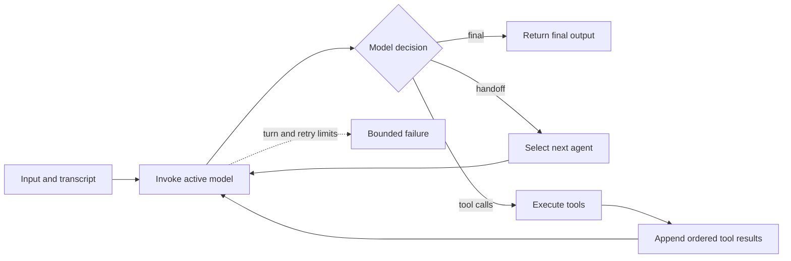

# Loop-based agent orchestration runtime

**This directory is an executable agent orchestration runtime.** It implements the conventional model/tool/handoff feedback loop directly, without compiling the workflow into the graph or sheaf runtime.

## What it owns

The canonical state is the direct runner state: current agent, transcript, turn count, pending model result, tool results, retry state, approvals, and terminal output. The runner repeatedly invokes the active model and interprets one of three outcomes:

1. final output — terminate;
2. handoff — replace the active agent and continue;
3. tool calls — execute tools, append structured results, and continue.

The Autoresearch implementation uses the same direct-loop style for propose, edit, evaluate, compare, keep, or reset.



Source: [`../docs/graphs/loop-runtime.mmd`](../docs/graphs/loop-runtime.mmd).

## Supported orchestration mechanisms

- sequential model and deterministic steps;
- conditional routing from model output;
- agent handoffs;
- structured tool invocation;
- ordered concurrent tool batches;
- retries, timeouts, cancellation, and turn limits;
- approval boundaries for side effects;
- final-output termination;
- Git-owned Autoresearch keep/reset semantics.

## What it is not

- It is not a graph executor: there is no canonical node/edge workflow state.
- It is not a sheaf executor: there are no canonical stalks, restrictions, covers, or global-section certificates.
- It does not delegate execution to either of the other runtime packages.

## Main implementation

| File | Responsibility |
|---|---|
| `src/loop_baselines/agent_runner.py` | Direct model/tool/handoff runner |
| `src/loop_baselines/autoresearch.py` | Direct Autoresearch experiment loop |
| `examples/agent_runner_demo.py` | Runnable agent-loop demonstration |
| `examples/autoresearch_demo.py` | Runnable Autoresearch demonstration |

## Check it

From the release root:

```bash
python -m unittest discover -s 01-loop-based/tests -v
python 01-loop-based/examples/agent_runner_demo.py
python 01-loop-based/examples/autoresearch_demo.py
```

Cross-runtime behavior is checked independently in `conformance/` and `evaluation/`. The runtime does not share a common workflow wrapper with the graph or sheaf implementations.
