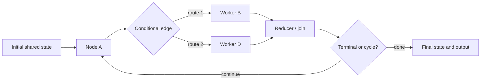

# Graph-based agent orchestration runtime

**This directory is an executable graph-native agent orchestration runtime.** It owns a shared state value, executable nodes, fixed and conditional edges, parallel supersteps, reducers, joins, cycles, checkpoints, and recovery. It does not wrap the loop runner and it does not use the sheaf runtime as a validator.

## What it owns

The canonical system is a compiled state graph:

- **State** is the current shared application snapshot.
- **Nodes** perform model calls, tools, routing, deterministic work, or state transformation.
- **Edges** select the next node or nodes.
- **Reducers and joins** reconcile concurrent node updates.
- **Checkpoints** retain graph execution state for recovery and replay.



Source: [`../docs/graphs/graph-runtime.mmd`](../docs/graphs/graph-runtime.mmd).

## Supported orchestration mechanisms

- sequential and conditional execution;
- model-controlled and deterministic routing;
- agent handoffs;
- structured tool invocation;
- parallel supersteps;
- fan-out and all-source fan-in;
- reducers for concurrent updates;
- cycles and evaluator/optimizer loops;
- retries, recursion bounds, timeouts, cancellation, and deadlock detection;
- checkpoint history, resume, state edits, and forks;
- graph-native Autoresearch keep/reset semantics.

## What it is not

- It is not a drawing around the loop implementation; graph execution is owned here.
- It is not a sheaf system: shared interfaces, restrictions, anchors, and globalization are not canonical graph primitives.
- A graph can encode those sheaf semantics, but then the relevant contracts must be explicitly present in its state, factors, validators, solver, and indexes.

## Main implementation

| File | Responsibility |
|---|---|
| `src/graph_baselines/state_graph.py` | Graph construction, shared state, edges, supersteps, reducers, joins, and recovery |
| `src/graph_baselines/agent_runner.py` | Graph-native model/tool/handoff orchestration |
| `src/graph_baselines/autoresearch.py` | Graph-native Autoresearch protocol |
| `examples/graph_patterns_demo.py` | Chains, routing, fan-out/fan-in, and cycles |
| `examples/agent_graph_demo.py` | Runnable agent graph |
| `examples/autoresearch_graph_demo.py` | Runnable graph-based Autoresearch |

## Check it

From the release root:

```bash
python -m unittest discover -s 02-graph-based/tests -v
python 02-graph-based/examples/graph_patterns_demo.py
python 02-graph-based/examples/agent_graph_demo.py
python 02-graph-based/examples/autoresearch_graph_demo.py
```

Cross-runtime behavior is checked independently in `conformance/` and `evaluation/`. The graph implementation is the non-strawman baseline: guarded and indexed graph variants are required to match the sheaf when they encode the same semantics.
