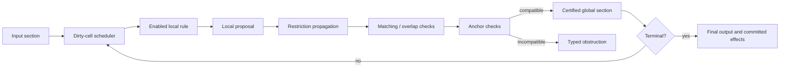

# Sheaf-native agent orchestration runtime

**This directory is an executable agent orchestration runtime whose canonical system state is a certified global section.** It performs sequencing, routing, handoffs, tool execution, retries, fan-out, fan-in, checkpointing, and termination directly through sheaf-native local rules and incremental section evolution.

It is not a graph execution followed by a sheaf consistency check.

## What it owns

A prepared sheaf defines:

- **site objects** for local agent, control, evidence, policy, tool, handoff, and output views;
- **stalk values** containing the state valid at each object;
- **restriction maps** specifying exactly what two local views must agree on at their shared interface;
- **covers and matching families** describing parallel decompositions and joins;
- **anchors** representing frozen or independently observed boundary conditions;
- **sections** assigning local values across the site;
- **global-section certification** deciding whether the complete local assignment is coherent;
- **typed obstructions** identifying the restriction, overlap, anchor, or affine constraint preventing globalization.

The runtime owns one current certified section and one revision. Dirty-cell indexes, trigger indexes, queues, and cached propagation plans are compiled execution indexes over that state. They do not constitute a second semantic graph.



Source: [`../docs/graphs/sheaf-runtime.mmd`](../docs/graphs/sheaf-runtime.mmd).

## How ordinary orchestration appears

| Mechanism | Sheaf-native interpretation |
|---|---|
| Sequencing | A committed local update enables the next local rule |
| Routing | A control stalk records the selected branch; compiled guards activate only its rule family |
| Handoff | One macrostep updates current-agent, transcript, handoff witness, and control phase coherently |
| Tool calls | Tool proposals are local values; results update evidence and transcript stalks |
| Retries | A failed branch retries within its local task while successful siblings remain staged |
| Fan-out | Independent local rules evaluate from one certified source revision |
| Fan-in | Staged proposals merge through stalk algebras, restrictions, covers, and one transactional commit |
| Termination | A terminal predicate is evaluated over the certified section |
| Recovery | Checkpoints are topology- and semantic-version-bound section histories |
| Dynamic workers | A topology delta creates a new prepared site and migrates the section; no mutable placeholder graph is retained |

## Supported orchestration mechanisms

- direct final-output, handoff, and tool-call agent execution;
- compiled routing predicates and dirty-rule selection;
- sequential and bounded parallel local rules;
- ordered concurrent tool batches;
- transactional fan-out/fan-in;
- branch-local retries without replaying successful siblings;
- timeouts, cancellation, compensation, and event isolation;
- approvals and frozen boundaries;
- incremental restriction propagation and local repair;
- topology-scoped checkpoints and resume;
- source-owned Autoresearch keep/reset semantics;
- exact rational consistency operators and proof-carrying obstruction certificates for bounded analyses.

## What is stronger than a bare graph

A bare graph records connectivity and execution order. This runtime additionally makes the following semantic objects first-class:

- selective agreement rather than whole-state equality;
- overlap compatibility;
- anchors outside optimizer authority;
- global-section existence;
- local repair and precise obstruction loci;
- derived exact consistency and cohomological evidence.

A projection-factor or indexed graph can encode the same objects and must then match the sheaf. The registered dominance claim is therefore class-conditional, not universal.

## Main implementation

| File | Responsibility |
|---|---|
| `src/sheaf_workflows/core.py` | Sites, stalks, restrictions, sections, boundaries, covers, repair, matching, and gluing |
| `src/sheaf_workflows/runtime.py` | Dirty scheduling, local rules, transactions, retries, timeouts, compensation, traces, and checkpoints |
| `src/sheaf_workflows/agent_runner.py` | Sheaf-native model/tool/handoff agent runner |
| `src/sheaf_workflows/autoresearch.py` | Sheaf-native Autoresearch protocol |
| `src/sheaf_workflows/refinement.py` | Immutable topology refinement and section migration |
| `src/sheaf_workflows/linear.py` | Exact consistency, global-section bases, energy, and affine obstruction certificates |
| `ORCHESTRATION.md` | Detailed executor design and optimization decisions |
| `SEMANTICS.md` | Formal computational-sheaf semantics |
| `MOONLIGHT_MAPPING.md` | Direct ownership-preserving mapping into Moonlight |
| `TEST_AUDIT.md` | Adversarial, generative, mutation, scale, and packaging evidence |

## Check it

From the release root:

```bash
python -m unittest discover -s 03-sheaf-based/tests -v
python 03-sheaf-based/examples/sheaf_primitives_demo.py
python 03-sheaf-based/examples/agent_sheaf_demo.py
python 03-sheaf-based/examples/autoresearch_sheaf_demo.py
python 03-sheaf-based/examples/linear_obstruction_demo.py
python 03-sheaf-based/examples/topology_refinement_demo.py
```

Then run the independent comparisons and retained-evidence verification:

```bash
python validate.py
python docs/check_documentation.py
PYTHONPATH=04-dominance-evaluation/src python -m sheaf_dominance.verify --root .
```

## Scope

This is an evidence-bearing executable reference, not a hosted orchestration service. External effects are not crash-atomically committed with durable distributed storage; synchronous in-process callbacks remain trusted; and dense exact analysis is deliberately budgeted for small proof-bearing systems.
