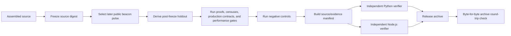

# Sheaf dominance evaluation and proof harness

**This directory is not an agent orchestration runtime.** It is the independent evaluation, proof, holdout, and retained-evidence package for the three executable runtimes in `01-loop-based`, `02-graph-based`, and `03-sheaf-based`.

It imports and executes those runtimes directly. It does not provide a shared workflow wrapper, adapter, or compatibility layer that could make all three pass through the same implementation.

## Registered claim

The release makes a bounded, falsifiable statement:

> The sheaf runtime strictly separates from the registered full-shared-state, pairwise-only, bounded-radius anonymous-local, and full-rescan loop/graph classes, while matching projection-factor and indexed graphs that encode the complete sheaf semantics.

The release explicitly rejects universal dominance over arbitrary graph programs. An arbitrary graph can encode every stalk, restriction, anchor, global solver, and incremental index; at that point it is an equivalent execution presentation.

The normative wording is in [`CLAIMS.md`](CLAIMS.md). The constructive reasoning is in [`proofs/FORMAL_ARGUMENT.md`](proofs/FORMAL_ARGUMENT.md).

## Evidence pipeline



Source: [`../docs/graphs/evidence-pipeline.mmd`](../docs/graphs/evidence-pipeline.mmd).

## What is checked

- exact finite sheaf/factor-graph equivalence;
- complete binary and directed finite censuses;
- complete Tseitin obstruction censuses and GF(2) certificates;
- fixed-radius anonymous-local lower-bound witnesses;
- selective-context and incremental-work separations;
- exact production end-state and trajectory parity;
- retry ownership, fan-out failure isolation, contention, and exactly-once idempotency checks;
- isolated-process local orchestration performance;
- post-freeze public holdouts;
- evaluator mutations and negative controls;
- source/evidence digest binding;
- independent Python and dependency-free Node.js verification;
- archive round-trip integrity.

## Run it

From the release root:

```bash
python -m unittest discover -s 04-dominance-evaluation/tests -v

PYTHONPATH=04-dominance-evaluation/src \
  python -m sheaf_dominance.scorecard \
  --root . \
  --pulse 04-dominance-evaluation/baseline/pulse.json

PYTHONPATH=04-dominance-evaluation/src \
  python -m sheaf_dominance.verify --root .

node 04-dominance-evaluation/independent_verify.mjs \
  --root . \
  --scorecard 04-dominance-evaluation/baseline/dominance.json \
  --manifest 04-dominance-evaluation/baseline/evidence_manifest.json \
  --pulse 04-dominance-evaluation/baseline/pulse.json \
  --negative-controls 04-dominance-evaluation/baseline/negative_controls.json
```

## Retained outputs

| File | Meaning |
|---|---|
| `baseline/dominance.md` | Human-readable scorecard |
| `baseline/dominance.json` | Machine-readable scorecard and gate results |
| `baseline/evidence_manifest.json` | SHA-256 source/evidence binding |
| `baseline/negative_controls.json` | Deliberate evidence corruptions detected by the evaluator |
| `baseline/freeze.json` | Source-freeze commitment |
| `baseline/pulse.json` | Public post-freeze beacon response |
| `baseline/beacon_provenance.json` | Holdout provenance and timing |
| `baseline/python_verification.log` | Independent Python verification result |
| `baseline/node_verification.log` | Independent Node.js verification result |
| `baseline/archive_roundtrip.json` | Byte-for-byte release round-trip result |

## Trust boundary

A passing scorecard establishes the registered class-conditional result and the recorded production, locality, resilience, and performance properties for the pinned source. It does not establish universal superiority over arbitrary graph programs, better language-model intelligence, authenticated distributed persistence, or crash-atomic external effects.
