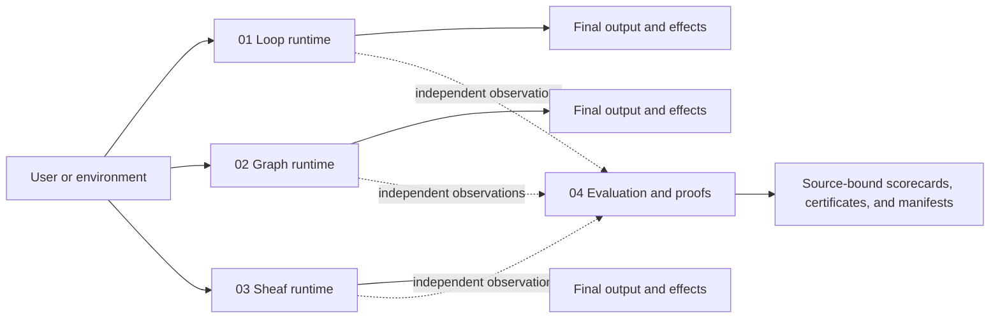
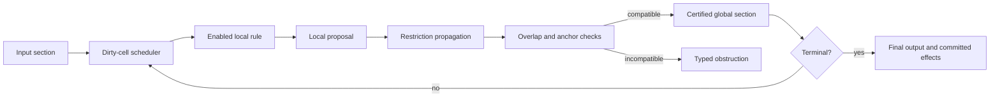

# Agentic Workflows: loop, graph, and sheaf orchestration

**This archive contains three independent, executable agent orchestration runtimes and one independent evaluation package.** It is not merely a set of workflow diagrams, and the sheaf implementation is not a validator wrapped around the graph implementation.

The three runtimes execute the same production-shaped agent mechanisms through different canonical state models:

- **Loop:** the current agent, transcript, model response, tool results, and stop condition evolve in a direct feedback loop.
- **Graph:** shared state evolves through executable nodes and fixed or conditional edges, including parallel supersteps and joins.
- **Sheaf:** local agent states evolve over typed shared interfaces; restrictions, anchors, and global-section certification determine whether local proposals form one valid system state.

`04-dominance-evaluation` is an evaluation and proof harness. It executes the runtimes directly, but it is **not** itself an orchestrator.

## Repository map

| Path | Classification | Canonical state owner | Purpose |
|---|---|---|---|
| `01-loop-based/` | Agent orchestration runtime | Direct runner state and transcript | Minimal model/tool/handoff loop and Autoresearch baseline |
| `02-graph-based/` | Agent orchestration runtime | Shared graph state | Nodes, edges, routing, parallel supersteps, fan-out/fan-in, cycles, and recovery |
| `03-sheaf-based/` | Agent orchestration runtime | Certified global section over local stalks | Local execution, selective agreement, anchors, gluing, obstruction reporting, and incremental repair |
| `04-dominance-evaluation/` | Evaluation and proof package | Independent contracts and retained evidence | Claim boundaries, finite censuses, lower bounds, holdouts, production comparisons, performance gates, and independent verification |
| `conformance/` | Cross-runtime tests | Test-owned normalized observations | Verifies that the three independent runtimes produce equivalent observable behavior |
| `evaluation/` | Mechanism scorecard | Scorer-owned contracts | Behavioral parity, grounding, locality, resilience, and orchestration measurements |
| `docs/` | Normative documentation | `SYSTEM_MANIFEST.json` plus checked Markdown and Mermaid sources | Explains the system and makes its identity and verification surface machine-checkable |

The complete release map is also available as [`docs/graphs/release-map.mmd`](docs/graphs/release-map.mmd).



## What is actually orchestrated

All three runtimes exercise the operational mechanisms normally meant by *agent orchestration*:

- sequencing model and deterministic steps;
- conditional routing;
- agent handoffs;
- structured tool calls and ordered tool results;
- retries, limits, timeouts, and cancellation;
- parallel work and fan-in;
- side-effect ownership and idempotency checks;
- final-output termination;
- production-shaped Autoresearch keep/reset control.

The implementations do not share a common workflow wrapper. Each runtime owns and executes its own semantics. Cross-formulation tests compare terminal state, normalized trajectory, external calls, retries, failures, and Git effects.

## How the state models differ

| Question | Loop | Graph | Sheaf |
|---|---|---|---|
| What is the current state? | Runner state and transcript | One shared state value | A section assigning a local value to each site object |
| What chooses the next work? | Model result and loop branch | Edges and conditional routing | Dirty-cell scheduler and enabled local rules |
| How is parallel work joined? | Runner-specific batch logic | Reducers and join nodes | Matching families, stalk merges, restrictions, and certification |
| What does an interface mean? | Convention in runner code | State schema and edge contract | An explicit lower-dimensional stalk with restriction maps |
| How are conflicts reported? | Runtime/tool error | Reducer, node, or graph error | Restriction, overlap, anchor, or global-section obstruction |
| Can a graph encode the same sheaf? | Not relevant | Yes, if it carries every stalk, restriction, anchor, solver, and index | That graph is an execution presentation of the sheaf semantics |

## Sheaf-native execution

The sheaf runtime performs the orchestration. It does not run a graph and inspect the result afterward.



The canonical semantic state is the certified section. Trigger indexes, queues, and cached propagation plans are compiled execution indexes over that section model; they are not a second semantic graph.

## Check it rather than trust the prose

Run these commands from the archive root:

```bash
# Validate all three runtimes, conformance, scorecards, examples, and packaging.
python validate.py

# Validate the documentation, graph sources, manifest, commands, and classification claims.
python docs/check_documentation.py

# Run the source-bound dominance tests.
python -m unittest discover -s 04-dominance-evaluation/tests -v

# Recompute and verify the retained source-bound evidence in Python.
PYTHONPATH=04-dominance-evaluation/src \
  python -m sheaf_dominance.verify --root .

# Verify the same retained evidence with an independent dependency-free Node.js program.
node 04-dominance-evaluation/independent_verify.mjs \
  --root . \
  --scorecard 04-dominance-evaluation/baseline/dominance.json \
  --manifest 04-dominance-evaluation/baseline/evidence_manifest.json \
  --pulse 04-dominance-evaluation/baseline/pulse.json \
  --negative-controls 04-dominance-evaluation/baseline/negative_controls.json
```

The machine-readable declaration of what this release contains is [`SYSTEM_MANIFEST.json`](SYSTEM_MANIFEST.json). [`docs/CHECKABILITY.md`](docs/CHECKABILITY.md) maps every public claim to its command, source, and retained evidence. [`docs/ARCHITECTURE.md`](docs/ARCHITECTURE.md) explains the runtime ownership boundaries in detail.

## Retained evidence

| Evidence | Location | What it establishes |
|---|---|---|
| Dominance scorecard | `04-dominance-evaluation/baseline/dominance.{md,json}` | Registered class-conditional separation, equivalence boundaries, production parity, and performance gates |
| Evidence manifest | `04-dominance-evaluation/baseline/evidence_manifest.json` | SHA-256 binding of source and retained evidence |
| Negative controls | `04-dominance-evaluation/baseline/negative_controls.json` | The evaluator rejects deliberately corrupted claims and evidence |
| Source freeze | `04-dominance-evaluation/baseline/freeze.json` | Source digest committed before holdout selection |
| Beacon provenance | `04-dominance-evaluation/baseline/beacon_provenance.json` | Public post-freeze holdout provenance |
| Python verification | `04-dominance-evaluation/baseline/python_verification.log` | Independent Python verifier accepted the evidence |
| Node verification | `04-dominance-evaluation/baseline/node_verification.log` | Independent Node.js verifier accepted the same evidence |
| Archive round trip | `04-dominance-evaluation/baseline/archive_roundtrip.json` | Extracted release matched the assembled release byte-for-byte |

## Claim boundary

The release proves strict separation from the registered full-shared-state, pairwise-only, bounded-radius anonymous-local, and full-rescan loop/graph classes. It requires equality with projection-factor and indexed graph systems that encode the complete sheaf semantics.

It does **not** claim that a sheaf can strictly dominate every possible graph program. A sufficiently expressive graph can encode the same local domains, restriction maps, anchors, global solver, and incremental indexes. At that point it is an equivalent presentation, not a weaker comparison class. The normative claim language is in [`04-dominance-evaluation/CLAIMS.md`](04-dominance-evaluation/CLAIMS.md).

## Scope

This is a high-quality executable reference and evidence-bearing research release. It is not a hosted agent service and does not claim crash-atomic distributed effects, authenticated durable checkpoints, process isolation for hostile callbacks, or better language-model intelligence merely from changing the orchestration model.
