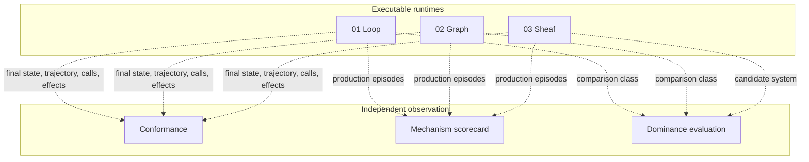
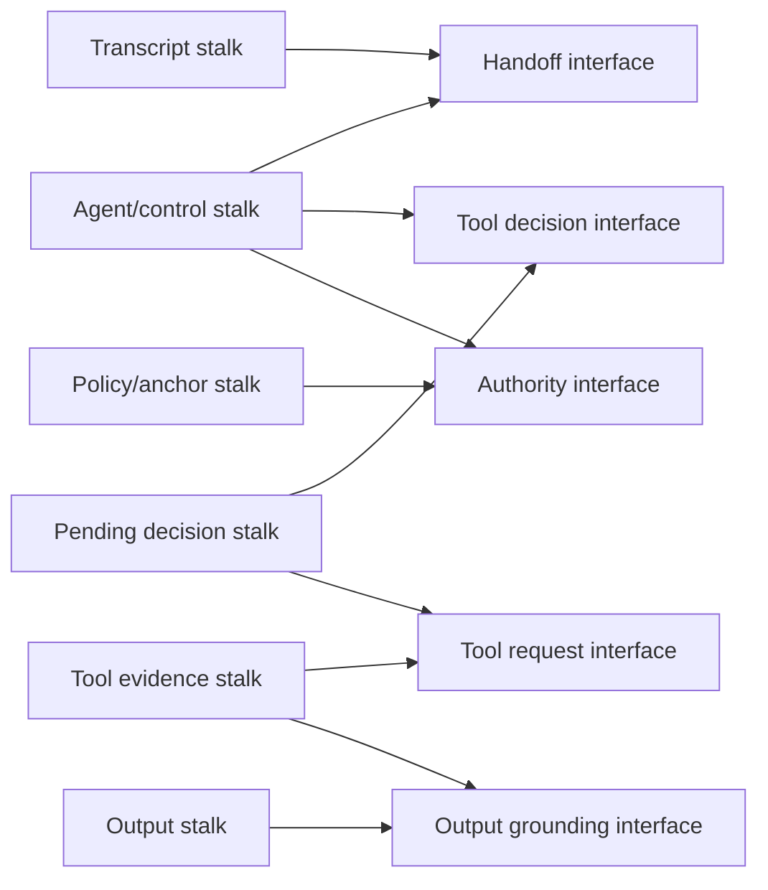

# Architecture: three independent orchestration runtimes

This release compares three ways to own and evolve an agent system. All three execute models, tools, handoffs, retries, parallel work, and terminal output. They differ in the canonical semantic state from which execution is derived.

## Classification

```text
01-loop-based            executable agent orchestration runtime
02-graph-based           executable agent orchestration runtime
03-sheaf-based           executable agent orchestration runtime
04-dominance-evaluation  evaluation and proof harness; not an orchestrator
```

The three runtimes are independent. They do not call one another and do not delegate to a shared workflow wrapper. `conformance/`, `evaluation/`, and `04-dominance-evaluation/` observe them from outside.

## Release topology



## Loop ownership

The loop runtime owns one evolving runner state. The current model returns a final value, a handoff, or tool calls. The runner interprets the result, updates its transcript and current agent, and repeats until a stop condition or limit is reached.

```text
state = current agent + transcript + pending result + counters + effects
next  = interpret(model(state))
```

This representation is direct and efficient for ordinary tool-using agents. Interface agreement and global constraints are implemented as runner policy rather than as separate canonical mathematical objects.

## Graph ownership

The graph runtime owns one shared state and a compiled set of executable nodes and edges.

```text
state = shared application snapshot
next  = nodes selected by fixed or conditional edges
join  = reducers and explicit join conditions
```

This representation naturally exposes sequencing, routing, fan-out/fan-in, cycles, and checkpointed supersteps. Its semantics are exactly the state schema, nodes, edges, reducers, validators, and persistence rules the graph declares.

## Sheaf ownership

The sheaf runtime owns a prepared site and a certified global section.

```text
state = section : site object -> local stalk value
valid = every restriction, overlap, and anchor agrees
next  = enabled local rules selected from changed cells
join  = stalk merges + restriction propagation + global certification
```

A local rule reads a downward-closed local region and proposes changes to declared cells. Parallel rules observe the same certified source revision. Their proposals remain staged until the runtime:

1. merges writes through the owning stalk algebras;
2. propagates affected restrictions;
3. validates cover overlaps;
4. rechecks affected anchors;
5. certifies the candidate as a global section;
6. commits one new revision or returns a typed obstruction.

The queue, trigger index, and cached propagation cones are compiled execution indexes. They accelerate the canonical section semantics; they do not own a second graph-shaped meaning.

## Sheaf agent layout

A practical agent site separates views that are usually collapsed into one shared state dictionary:



The arrows are restriction maps into shared interfaces. Compatibility means the local views make the same claim when projected onto the interface—not that their entire states are equal.

## Orchestration mechanism mapping

| Mechanism | Loop | Graph | Sheaf |
|---|---|---|---|
| Sequence | Next loop branch | Fixed edge | Rule enabled by committed local state |
| Route | Model/result branch | Conditional edge | Control-stalk value plus compiled guard |
| Handoff | Replace current agent | Handoff node/edge | Coherent update of agent, control, transcript, and handoff witness |
| Tool call | Execute then append result | Tool node and state update | Tool proposal/evidence stalk update with interface checks |
| Retry | Runner retry policy | Node/superstep retry | Branch-local retry before transactional fan-in |
| Fan-out | Explicit concurrent batch | Parallel destinations | Independent local rules from one certified revision |
| Fan-in | Batch result handling | Reducer/join node | Matching, merge, restriction propagation, and one certified commit |
| Checkpoint | Runner/session snapshot | Graph checkpoint | Topology- and semantic-version-bound section checkpoint |
| Invalid join | Runner error | Reducer/validator error | Typed restriction, overlap, anchor, or affine obstruction |

## Dynamic topology

Dynamic workers do not require a permanently duplicated graph representation in the sheaf runtime. The orchestrator emits a topology delta, compiles a new prepared site, and migrates the current section through ordinary restriction and repair semantics. The old and new topology identities remain distinct, so a checkpoint cannot silently resume against changed meaning.

## Effects and persistence

The runtimes demonstrate effect ownership, idempotency keys, ordered commits, compensation, and checkpoint boundaries. They do not claim a distributed transaction spanning an external side effect and durable storage. A production service needs a persistence owner such as a transactional outbox or an idempotent effect ledger committed with checkpoint state.

## Equivalence boundary

A graph can encode a sheaf exactly by representing every local domain, restriction, anchor, consistency factor, global solver, and incremental index. Such a graph must match the sheaf and is treated as an equivalent execution presentation. The strict dominance result applies only to the registered weaker classes documented in `04-dominance-evaluation/CLAIMS.md`.

## Normative machine-readable description

`SYSTEM_MANIFEST.json` is the canonical machine-readable classification surface. `docs/check_documentation.py` verifies that this document, every public README, each Mermaid source, the declared runtime paths, examples, test directories, retained evidence, and verification commands remain consistent with that manifest.
