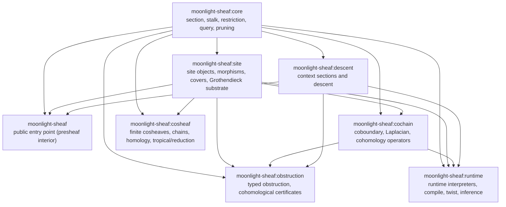

# moonlight-sheaf

> Part of **Moonlight**, the sheaf-theoretic computation layer beneath
> [Melusine](https://bluerose.blue) and Pale Meridian.

Sublibraries own categorical layers. Downstream components depend on the
narrow owner directly, and the public library exposes the stable sheaf entry
point.

## Layout

The physical layout mirrors the Cabal component boundary directly:

- `src-core`, `src-site`, `src-cochain`, `src-descent`, `src-runtime`, `src-obstruction`, and `src-cosheaf` are implementation sublibrary roots.
- `src-public` plus `src-presheaf` provide the public entry point and its hidden presheaf implementation (`other-modules`).
- `test` contains one consolidated internal suite with semantic clusters under `Moonlight/Sheaf/{Core,Site,Presheaf,Cochain,Descent,Runtime,Query,Obstruction,Propagation}` and `Moonlight/Cosheaf/{Core,Chain,Homology,Surface}`.
- `test/Moonlight/Sheaf/Effect` is the law registry, `test/Moonlight/Sheaf/TestFixture` and `test/Moonlight/Cosheaf/Test` are fixture layers, and `test/Moonlight/Sheaf/Surface` owns the public surface locks.
- `bench` owns benchmark entrypoints.
- `src-flow` is an adjacent Cabal package, `moonlight-sheaf-flow`, for relational sheaf integration.

Source roots track Cabal stanzas directly. The Cabal stanza is the component owner; the filesystem is its source root.

## Quick start

The core operation is local-to-global. Declare a `Site` with its objects and
restriction morphisms, then `compile` a `SiteSpec` into a
`PreparedSite`, lay a `Section` that assigns a stalk to every object, and
promote it. `globalSection` succeeds exactly when the local data agree across
every restriction; compatibility is decided by a `StalkAlgebra`, and
`discreteStalkAlgebra` compares stalks by equality.

```haskell
import Moonlight.Sheaf
import Moonlight.Sheaf.Stalk (discreteStalkAlgebra)
import Data.Bifunctor (first)
import Data.Map.Strict qualified as Map

data Cell = Parent | Child
  deriving stock (Eq, Ord, Show)

data Restriction = Restriction Cell Cell
  deriving stock (Eq, Ord, Show)

data Interval = Interval

arrow :: Cell -> Cell -> Maybe (CheckedMorphism Cell Restriction)
arrow source target
  | source == target || (source == Parent && target == Child) =
      Just (CheckedMorphism source target (Restriction source target))
  | otherwise = Nothing

checked :: Cell -> Cell -> CheckedMorphism Cell Restriction
checked source target =
  case arrow source target of
    Just morphism -> morphism
    Nothing -> CheckedMorphism source target (Restriction source target)

instance Site Interval where
  type SiteObject Interval = Cell
  type SiteMorphism Interval = Restriction

  siteObjects _ = [Parent, Child]
  siteMorphisms _ = [checked Parent Parent, checked Child Child, checked Parent Child]
  identityAt _ cell = checked cell cell
  coversAt _ _ = []

  composeChecked _ outer inner
    | cmTarget inner == cmSource outer = arrow (cmSource inner) (cmTarget outer)
    | otherwise = Nothing

  pullbackPair _ left right
    | cmTarget left == cmTarget right =
        Just
          PullbackSquare
            { psLeftBase = left,
              psRightBase = right,
              psApex = cmSource left,
              psToLeft = checked (cmSource left) (cmSource left),
              psToRight = checked (cmSource left) (cmSource right)
            }
    | otherwise = Nothing

globalOverInterval :: Either String (GlobalSection Interval Int)
globalOverInterval = do
  preparedSite <- first show (compile (siteSpec Interval))
  sectionValue <- first show (section preparedSite (Map.fromList [(Parent, 7), (Child, 7)]))
  first show (globalSection discreteStalkAlgebra sectionValue)
```

Read a single stalk with `stalkAt`, revise a section through `assign`/`assignOne`,
ask for the typed compatibility verdict without promoting via `certify`, and
amalgamate a matching family over a cover with `glue` and a `GluingAlgebra`.

## Sublibrary DAG



Read an arrow as “upstream owner is required by downstream consumer.” `moonlight-sheaf:runtime` consumes descent. Benchmarks and experiments may import `moonlight-sheaf:cochain` directly. The presheaf layer (finite presheaves, sheafification, image functors, gluing) lives inside the public library as `other-modules`; the law registry and test fixtures compile inside the consolidated test suite.

The propagation toy is a fixture-backed validation and benchmark harness under `Moonlight.Sheaf.TestFixture.PropagationToy`, consumed by the consolidated `moonlight-sheaf-test` suite (`Moonlight.Sheaf.Propagation.*`) and the propagation benchmark groups. The relational bridge belongs to the adjacent `moonlight-sheaf-flow` package, whose `relational` sublibrary owns flow-backed sheaf integration.

## Ownership table

| Sublibrary | Owns | Boundary |
| --- | --- | --- |
| `moonlight-sheaf:core` | Section algebra, stalk algebra, restriction indices, basis/indexing, pruning verdicts. | Site topology, runtime execution, domain policy. |
| `moonlight-sheaf:site` | Sites, checked morphisms, covers, finite meet sites, Grothendieck/context topology, nerves, site maps. | Presheaf/sheafification APIs, operator/cochain semantics, runtime descent authority. |
| `moonlight-sheaf` | Public entry point over `core`, `site`, and descent reports; owns the presheaf interior (finite presheaves, morphisms, sheafification, matching/gluing, image functors) as hidden `other-modules`. | Computational/orchestration bundle, cochain dependency in the library, runtime dependency in the library, exposing presheaf modules as an importable surface. |
| `moonlight-sheaf:cochain` | Coboundary complexes, Laplacians, cohomology and prepared operator views. | Public sheaf handles and runtime descent. |
| `moonlight-sheaf:descent` | Context sections, context algebra, payload sections, and assignment/quotient descent. | Runtime compilation, twist execution, cohomological obstruction policy. |
| `moonlight-sheaf:obstruction` | Typed obstruction certificates, cohomological witnesses, pruning gates, exact coverage diagnostics. | Runtime interpretation. |
| `moonlight-sheaf:runtime` | Runtime context rows, compile/runtime interpreters, twist execution, inference. | Source-of-truth descent/context substrate. |
| `moonlight-sheaf:cosheaf` | Covariant finite cosheaves, cosections, colimits, chains, homology, tropical/reduction machinery. | Sheaf public surface or runtime interpreters. |

Query utilities live inside `moonlight-sheaf:core` (`Moonlight.Sheaf.Query.*`). The law registry (`test/Moonlight/Sheaf/Effect`), shared fixtures, and the propagation toy harness (`test/Moonlight/Sheaf/TestFixture`) compile inside the consolidated `moonlight-sheaf-test` suite and own no production semantics.

Adjacent package: `moonlight-sheaf-flow:relational` owns the relational-backed sheaf bridge.

## Default build rule

The unnamed `library` stanza in `moonlight-sheaf.cabal` is sacred:

```text
moonlight-sheaf library -> moonlight-sheaf:core + moonlight-sheaf:site + moonlight-sheaf:descent
                           (+ the src-presheaf interior it owns directly)
```

Keep these components outside the default library dependency set:

- `moonlight-sheaf:cochain`
- `moonlight-sheaf:obstruction`
- `moonlight-sheaf:runtime`
- `moonlight-sheaf:cosheaf`
- `moonlight-sheaf-flow:relational`

Benchmarks, tests, examples, and workbenches may import heavier sublibraries explicitly. The public entry point stays small and honest.

## Split rule

Create a real sublibrary only when both are true:

1. The code owns a construction or interpretation with a stable categorical role.
2. Common downstream builds avoid pulling it unless they actually need that role.

A new component needs a real owner and dependency-pressure proof before names such as `computational`, `analysis`, `duality`, `homology`, `linear`, or `workbench` are useful.

## Pending owner cuts

These modules currently live in the `site` source tree outside the `Moonlight.Sheaf.Site` umbrella:

- `Moonlight.Sheaf.Site.Analysis.Scaffold`
- `Moonlight.Sheaf.Site.Analysis.Microsupport*`
- `Moonlight.Sheaf.Site.Stalk.Restriction`
- `Moonlight.Sheaf.Site.Stalk.Interface*`
- `Moonlight.Sheaf.Site.System.Execution`
- `Moonlight.Sheaf.Site.Phase`

Move these only when the semantic owner is proven by imports and Cabal pressure. Pure site vocabulary stays in site. Operator, stalk, and cochain construction moves to the matching owner with callers updated directly.

## Validation cuts

From the package root:

```text
cabal build moonlight-sheaf -j1
cabal build moonlight-sheaf:lib:descent -j1
cabal build moonlight-sheaf:lib:runtime -j1
cabal build moonlight-sheaf:lib:obstruction -j1
cabal test moonlight-sheaf:test:moonlight-sheaf-test -j1
cabal test moonlight-sheaf:test:moonlight-sheaf-public-test -j1
cabal build moonlight-sheaf:bench:moonlight-sheaf-bench-quick -j1
```

Use narrower package/component builds first. If Cabal reports a missing module, add the dependency on the sublibrary that owns the module.

The propagation toy harness is fixture-backed. Its reusable model lives in `test/Moonlight/Sheaf/TestFixture` and compiles inside the consolidated `moonlight-sheaf-test` suite and the benchmark targets.
