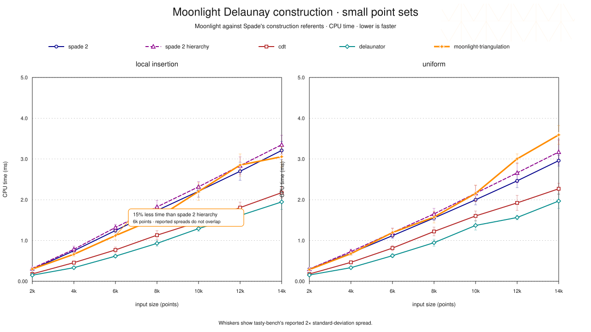
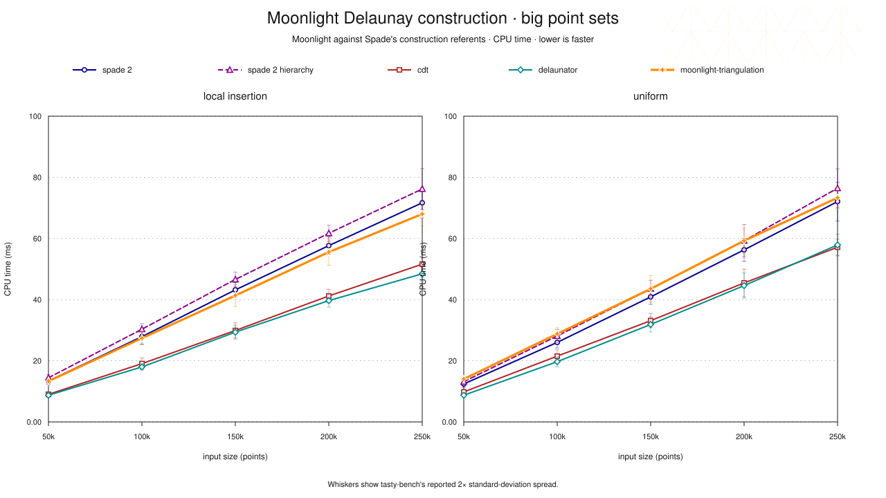

# Moonlight Delaunay Compare

`moonlight-triangulation-delaunay-compare` is Moonlight's package-owned port of Spade's
[`delaunay_compare`](https://github.com/Stoeoef/spade/tree/c8befc96bbbc1898a89cb19f9f3104a848936374/delaunay_compare)
construction suite. It retains the upstream case matrix and appends
`moonlight-triangulation` to the implementation list:

1. `spade 2`
2. `spade 2 hierarchy`
3. `cdt`
4. `delaunator`
5. `moonlight-triangulation`

Haskell owns fixture selection, grouping, compatibility descent, timing, and
reporting. The Rust library under `rust/src/lib.rs` is only a typed foreign
boundary to the four Rust implementations and to the exact upstream `rand`
fixture stream; it contains no benchmark policy.

This executable is the construction slice, not the package's overall
comparison. The [package benchmark overview](../../README.md#overall-moonlightspade-comparison)
also exposes insertion, removal, nearest-neighbour search, CDT recovery,
refinement, natural-neighbour interpolation, Voronoi, DCEL, and segment
traversal lanes.

## Pictures

Both pictures are derived from the single retained board.





These retain Spade's plain GNUPLOT idiom: white field, Helvetica, dashed grey
grid, jewel-coloured point series, and the same small/big split. Moonlight is
the heavier orange star. The faint triangulation mesh is the sole bit of
levity; benchmark charts need not resemble tax forms.

## Result

- timed cases: `120`
- fixture summaries agreeing across all five implementations: `24 / 24`
- Moonlight mean below plain Spade: `12 / 24`
- Moonlight mean below Spade hierarchy: `17 / 24`
- Moonlight below plain Spade with non-overlapping reported 2σ: `0 / 24`
- Moonlight below Spade hierarchy with non-overlapping reported 2σ: `1 / 24`
- lowest fixture mean: `delaunator` `23 / 24`; `cdt` `1 / 24`
- median reported 2σ / mean: Moonlight `7.86%`; plain Spade `6.74%`

Selected means are in milliseconds. Δ is
`100 × (Moonlight / competitor − 1)`.

| fixture | points | Moonlight | plain Spade | Δ | Spade hierarchy | Δ |
|---|---:|---:|---:|---:|---:|---:|
| local insertion | 4,000 | 0.663 | 0.748 | −11.3% | 0.784 | −15.4% |
| local insertion | 6,000 | 1.121 | 1.245 | −10.0% | 1.320 | −15.1% |
| local insertion | 8,000 | 1.552 | 1.736 | −10.6% | 1.824 | −14.9% |
| local insertion | 250,000 | 68.017 | 71.675 | −5.1% | 76.208 | −10.7% |
| uniform | 4,000 | 0.676 | 0.693 | −2.4% | 0.729 | −7.3% |
| uniform | 14,000 | 3.591 | 2.959 | +21.4% | 3.171 | +13.3% |
| uniform | 250,000 | 73.329 | 72.076 | +1.7% | 76.447 | −4.1% |

The measured Moonlight path is the canonical circle-sweep bulk loader. Its
local descent carries an already-read hull angle through candidate search,
rejects incompatible closure sections before paying for exact orientation,
and compiles the exact predicate and repair kernels at their LLVM `-O3`
boundary.

Receipt identity:

- command completed: `2026-08-17T10:39:30Z`, 297.39 s over 120 cases
- host: Apple M4 Pro, arm64, macOS 26.5.2, GHC 9.14.1, rustc 1.92.0
- Haskell build: Cabal `-O1` package profile, comparison executable `-O2`, hot
  predicate, sweep, and repair modules LLVM `-O3`
- checkout HEAD: `6da6feb1a6`, with seven modified files in the tree, none of
  them on the measured path
- CSV: [`moonlight-delaunay-compare-2026-08-17.csv`](results/moonlight-delaunay-compare-2026-08-17.csv), SHA-256
  `eba77eb960790f2e1cbe3f82c112e8690721de4e5aa3c69961925670e0822162`
- benchmark runtime-source hashes:
  [`moonlight-delaunay-compare-2026-08-17.source-sha256`](results/moonlight-delaunay-compare-2026-08-17.source-sha256)

The Haskell projection in
`Moonlight.Triangulation.Bench.DelaunayCompare.Picture` parses the tasty-bench
CSV against the exact closed 120-case registry and reports typed obstructions
for malformed, unknown, duplicated, or missing observations before gluing
either picture.

## Run

From the repository root, list the complete benchmark tree:

```console
scripts/safe-cabal.sh run \
  moonlight-triangulation:exe:moonlight-triangulation-delaunay-compare \
  -- --list-tests
```

Run the comparison on one uncontended thread with wall-clock timing:

```console
scripts/safe-cabal.sh run \
  moonlight-triangulation:exe:moonlight-triangulation-delaunay-compare \
  -- --time-mode wall -j1
```

The Haskell executable builds the pinned Rust library through Cargo before it
loads the library. Cargo's incremental no-op is cheap after the first run. Set
`MOONLIGHT_DELAUNAY_COMPARE_RUST_MANIFEST` only when invoking an installed executable
outside this repository layout.

## Reproduce a board

Every candidate run uses one CPU-time worker, a 30-second per-case timeout, and
tasty-bench's `--stdev 5` calibration target. Name the candidate by the date it
completed; after validation, it replaces the retained CSV and source manifest
rather than accumulating a benchmark diary.

```console
caffeinate -i scripts/safe-cabal.sh run \
  moonlight-triangulation:exe:moonlight-triangulation-delaunay-compare -- \
  --stdev 5 --timeout 30s --time-mode cpu -j1 \
  --csv foundation/moonlight-triangulation/bench/delaunay-compare/results/moonlight-delaunay-compare-YYYY-MM-DD.csv \
  --color never --hide-progress --min-duration-to-report 1h
```

Both pictures are then regenerated from the candidate CSV, which is the only
CSV they may be derived from:

```console
scripts/safe-cabal.sh run \
  moonlight-triangulation:exe:moonlight-triangulation-delaunay-pictures -- \
  foundation/moonlight-triangulation/bench/delaunay-compare/results/moonlight-delaunay-compare-YYYY-MM-DD.csv \
  foundation/moonlight-triangulation/bench/delaunay-compare/results
```

The runtime-source manifest beside the CSV is the list of files that entered
timed actions, hashed at run time; picture sources and package-only metadata
are excluded because they do not. The receipt and SVGs stay package-owned
beside the benchmark but are not Cabal package inputs, because taking a
measurement must not rebuild the triangulation library.

## Upstream-compatible fixtures

Both distributions use the 32-byte `StdRng` seed from upstream, including its
embedded newline byte. Rust unit tests pin the first three points of both
streams by their exact binary64 bit patterns.

- `local insertion` starts at `(0, 1)` and adds independent inclusive steps
  from `[-1, 1]`.
- `uniform` draws each coordinate independently and inclusively from
  `[-1e9, 1e9]`.
- `small` contains 2,000 through 14,000 points in increments of 2,000.
- `big` contains 50,000 through 250,000 points in increments of 50,000.

Native input conversion happens once during suite preparation, outside every
timed action, exactly as upstream's `DelaunayCrate.init` separates conversion
from `run_creation`. Spade still clones its owned vertex vector inside each
construction call because that is what its bulk-load API and upstream adapter
require; `cdt`, `delaunator`, and Moonlight consume their prepared vectors by
reference.

## Compatibility gate

Before `tasty-bench` runs, every one of the 24 fixtures descends across all five
implementations. The sections glue only when vertex and inner-triangle counts
agree. A generator, preparation, construction, foreign-boundary, or summary
failure is a typed obstruction and terminates the command before timing.

This count gate is deliberately not a second topology authority. The stronger
Moonlight-versus-Spade canonical-edge and operation agreement owner is the
[`spade-compare` operation suite](../spade-compare/README.md); use it when making semantic parity claims. This command answers
the narrower upstream question: bulk construction time over the upstream point
distributions and sizes.

The upstream `examples/real_data_benchmark.rs` CDT/shapefile program is a
separate executable and is not folded into this creation suite. No 45 MB dataset
or network fetch is concealed in benchmark startup.

## Harness difference

Upstream uses Rust Criterion. This port uses Haskell `tasty-bench`, so it does
not pretend Criterion's warm-up seconds or sample-count knobs map one-to-one to
another calibrator. The inputs, sizes, implementation calls, and timed/setup
boundary are preserved; calibration and reporting are honestly Haskell.
